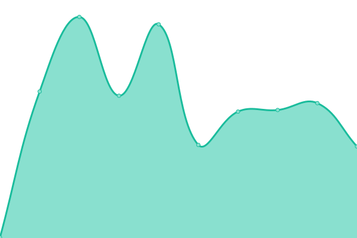
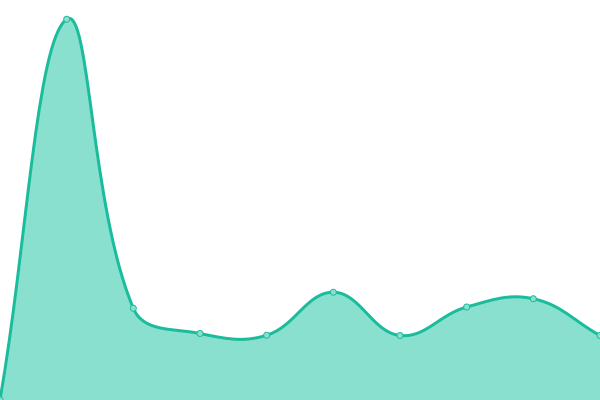
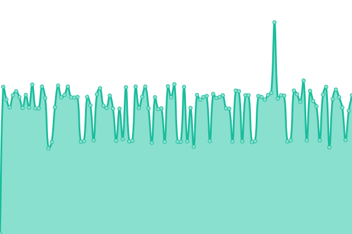
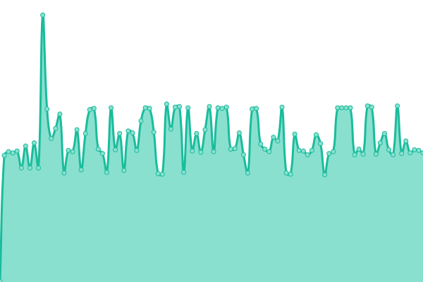
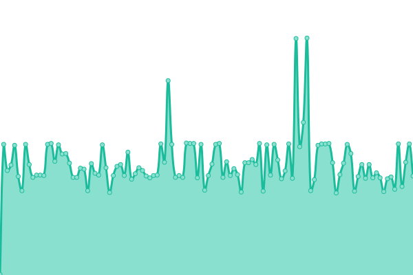
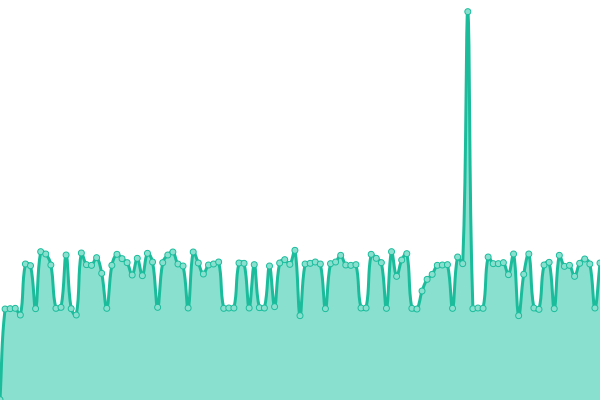
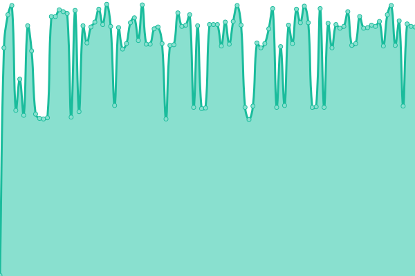
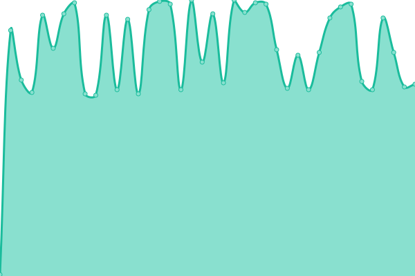

# [📈 Live Status](https://stats.masterstream.ir): <!--live status--> **🟩 All systems operational**

This repository contains the open-source uptime monitor and status page for [Amin.MasterkinG](https://masterking32.com), powered by [Upptime](https://github.com/upptime/upptime).

With [Upptime](https://upptime.js.org), you can get your own unlimited and free uptime monitor and status page, powered entirely by a GitHub repository. We use [Issues](https://github.com/masterking32/masterstream_uptime/issues) as incident reports, [Actions](https://github.com/masterking32/masterstream_uptime/actions) as uptime monitors, and [Pages](https://stats.masterstream.ir) for the status page.

<!--start: status pages-->
<!-- This summary is generated by Upptime (https://github.com/upptime/upptime) -->
<!-- Do not edit this manually, your changes will be overwritten -->
<!-- prettier-ignore -->
| URL | Status | History | Response Time | Uptime |
| --- | ------ | ------- | ------------- | ------ |
|  Website | 🟩 Up | [website.yml](https://github.com/masterking32/masterstream_uptime/commits/HEAD/history/website.yml) | 

 142ms
     
 | 

<a href="https://stats.masterstream.ir/history/website">100.00%</a>
    

|  RESTREAM-IR-2-ParsOnline-1 | 🟩 Up | [restream-ir-2-pars-online-1.yml](https://github.com/masterking32/masterstream_uptime/commits/HEAD/history/restream-ir-2-pars-online-1.yml) | 

 308ms
     
 | 

<a href="https://stats.masterstream.ir/history/restream-ir-2-pars-online-1">100.00%</a>
    

|  RESTREAM-IR-3-ParsOnline-2 | 🟩 Up | [restream-ir-3-pars-online-2.yml](https://github.com/masterking32/masterstream_uptime/commits/HEAD/history/restream-ir-3-pars-online-2.yml) | 

 233ms
     
 | 

<a href="https://stats.masterstream.ir/history/restream-ir-3-pars-online-2">100.00%</a>
    

|  RESTREAM-IR-4-ParsOnline-5 | 🟩 Up | [restream-ir-4-pars-online-5.yml](https://github.com/masterking32/masterstream_uptime/commits/HEAD/history/restream-ir-4-pars-online-5.yml) | 

 308ms
     
 | 

<a href="https://stats.masterstream.ir/history/restream-ir-4-pars-online-5">100.00%</a>
    

|  RESTREAM-IR-5-ZirSakht-1 | 🟩 Up | [restream-ir-5-zir-sakht-1.yml](https://github.com/masterking32/masterstream_uptime/commits/HEAD/history/restream-ir-5-zir-sakht-1.yml) | 

 324ms
     
 | 

<a href="https://stats.masterstream.ir/history/restream-ir-5-zir-sakht-1">100.00%</a>
    

|  RESTREAM-IR-6-Afranet-1 | 🟩 Up | [restream-ir-6-afranet-1.yml](https://github.com/masterking32/masterstream_uptime/commits/HEAD/history/restream-ir-6-afranet-1.yml) | 

 310ms
     
 | 

<a href="https://stats.masterstream.ir/history/restream-ir-6-afranet-1">100.00%</a>
    

|  RESTREAM-IR-7-ParsOnline-3 | 🟩 Up | [restream-ir-7-pars-online-3.yml](https://github.com/masterking32/masterstream_uptime/commits/HEAD/history/restream-ir-7-pars-online-3.yml) | 

 310ms
     
 | 

<a href="https://stats.masterstream.ir/history/restream-ir-7-pars-online-3">100.00%</a>
    

|  RESTREAM-IR-9-Afranet-2 | 🟩 Up | [restream-ir-9-afranet-2.yml](https://github.com/masterking32/masterstream_uptime/commits/HEAD/history/restream-ir-9-afranet-2.yml) | 

 376ms
     
 | 

<a href="https://stats.masterstream.ir/history/restream-ir-9-afranet-2">100.00%</a>
    

|  RESTREAM-IR-10-ParsOnline-4 | 🟩 Up | [restream-ir-10-pars-online-4.yml](https://github.com/masterking32/masterstream_uptime/commits/HEAD/history/restream-ir-10-pars-online-4.yml) | 

 364ms
     
 | 

<a href="https://stats.masterstream.ir/history/restream-ir-10-pars-online-4">100.00%</a>
    

|  RESTREAM-IR-11-ZirSakht-2 | 🟩 Up | [restream-ir-11-zir-sakht-2.yml](https://github.com/masterking32/masterstream_uptime/commits/HEAD/history/restream-ir-11-zir-sakht-2.yml) | 

 0ms
     
 | 

<a href="https://stats.masterstream.ir/history/restream-ir-11-zir-sakht-2">100.00%</a>
    

|  RESTREAM-IR-12-ZirSakht-3 | 🟩 Up | [restream-ir-12-zir-sakht-3.yml](https://github.com/masterking32/masterstream_uptime/commits/HEAD/history/restream-ir-12-zir-sakht-3.yml) | 

 364ms
     
 | 

<a href="https://stats.masterstream.ir/history/restream-ir-12-zir-sakht-3">100.00%</a>
    

|  RESTREAM-IR-13-Afranet-3 | 🟩 Up | [restream-ir-13-afranet-3.yml](https://github.com/masterking32/masterstream_uptime/commits/HEAD/history/restream-ir-13-afranet-3.yml) | 

 336ms
     
 | 

<a href="https://stats.masterstream.ir/history/restream-ir-13-afranet-3">100.00%</a>
    

|  RESTREAM-IR-14-Afranet-4 | 🟩 Up | [restream-ir-14-afranet-4.yml](https://github.com/masterking32/masterstream_uptime/commits/HEAD/history/restream-ir-14-afranet-4.yml) | 

 368ms
     
 | 

<a href="https://stats.masterstream.ir/history/restream-ir-14-afranet-4">100.00%</a>
    

|  RESTREAM-TR-1 | 🟩 Up | [restream-tr-1.yml](https://github.com/masterking32/masterstream_uptime/commits/HEAD/history/restream-tr-1.yml) | 

 187ms
     
 | 

<a href="https://stats.masterstream.ir/history/restream-tr-1">100.00%</a>
    

|  RESTREAM-EDGE-DE-1 | 🟩 Up | [restream-edge-de-1.yml](https://github.com/masterking32/masterstream_uptime/commits/HEAD/history/restream-edge-de-1.yml) | 

 143ms
     
 | 

<a href="https://stats.masterstream.ir/history/restream-edge-de-1">100.00%</a>
    

|  RESTREAM-EDGE-DE-2 | 🟩 Up | [restream-edge-de-2.yml](https://github.com/masterking32/masterstream_uptime/commits/HEAD/history/restream-edge-de-2.yml) | 

 139ms
     
 | 

<a href="https://stats.masterstream.ir/history/restream-edge-de-2">100.00%</a>
    

|  RESTREAM-EDGE-DE-3 | 🟩 Up | [restream-edge-de-3.yml](https://github.com/masterking32/masterstream_uptime/commits/HEAD/history/restream-edge-de-3.yml) | 

 138ms
     
 | 

<a href="https://stats.masterstream.ir/history/restream-edge-de-3">100.00%</a>
    

|  RESTREAM-EDGE-DE-4 | 🟩 Up | [restream-edge-de-4.yml](https://github.com/masterking32/masterstream_uptime/commits/HEAD/history/restream-edge-de-4.yml) | 

 138ms
     
 | 

<a href="https://stats.masterstream.ir/history/restream-edge-de-4">100.00%</a>
    

|  RESTREAM-EDGE-DE-5 | 🟩 Up | [restream-edge-de-5.yml](https://github.com/masterking32/masterstream_uptime/commits/HEAD/history/restream-edge-de-5.yml) | 

 137ms
     
 | 

<a href="https://stats.masterstream.ir/history/restream-edge-de-5">100.00%</a>
    

<!--end: status pages-->

[**Visit our status website →**](https://stats.masterstream.ir)

## 📄 License

- Powered by: [Upptime](https://github.com/upptime/upptime)
- Code: [MIT](./LICENSE) © [Amin.MasterkinG](https://masterking32.com)
- Data in the `./history` directory: [Open Database License](https://opendatacommons.org/licenses/odbl/1-0/)
