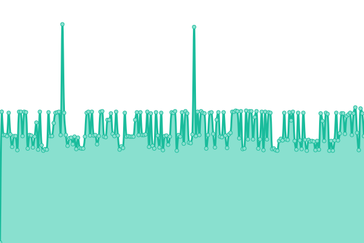

# [📈 Live Status](https://stats.masterstream.ir): <!--live status--> **🟧 Partial outage**

This repository contains the open-source uptime monitor and status page for [Amin.MasterkinG](https://masterking32.com), powered by [Upptime](https://github.com/upptime/upptime).

With [Upptime](https://upptime.js.org), you can get your own unlimited and free uptime monitor and status page, powered entirely by a GitHub repository. We use [Issues](https://github.com/masterking32/masterstream_uptime/issues) as incident reports, [Actions](https://github.com/masterking32/masterstream_uptime/actions) as uptime monitors, and [Pages](https://stats.masterstream.ir) for the status page.

<!--start: status pages-->
<!-- This summary is generated by Upptime (https://github.com/upptime/upptime) -->
<!-- Do not edit this manually, your changes will be overwritten -->
<!-- prettier-ignore -->
| URL | Status | History | Response Time | Uptime |
| --- | ------ | ------- | ------------- | ------ |
|  Website | 🟩 Up | [website.yml](https://github.com/masterking32/masterstream_uptime/commits/HEAD/history/website.yml) | 

 106ms
     
 | 

<a href="https://stats.masterstream.ir/history/website">100.00%</a>
    

|  Iran 1 - VIP 1 | 🟩 Up | [iran-1-vip-1.yml](https://github.com/masterking32/masterstream_uptime/commits/HEAD/history/iran-1-vip-1.yml) | 

 227ms
     
 | 

<a href="https://stats.masterstream.ir/history/iran-1-vip-1">75.79%</a>
    

|  Iran 1 - VIP 2 | 🟥 Down | [iran-1-vip-2.yml](https://github.com/masterking32/masterstream_uptime/commits/HEAD/history/iran-1-vip-2.yml) | 

 350ms
     
 | 

<a href="https://stats.masterstream.ir/history/iran-1-vip-2">99.99%</a>
    

|  Russia 1 | 🟩 Up | [russia-1.yml](https://github.com/masterking32/masterstream_uptime/commits/HEAD/history/russia-1.yml) | 

 150ms
     
 | 

<a href="https://stats.masterstream.ir/history/russia-1">100.00%</a>
    

|  Turkey 1 | 🟩 Up | [turkey-1.yml](https://github.com/masterking32/masterstream_uptime/commits/HEAD/history/turkey-1.yml) | 

 135ms
     
 | 

<a href="https://stats.masterstream.ir/history/turkey-1">100.00%</a>
    

|  Out - Germany 1 | 🟩 Up | [out-germany-1.yml](https://github.com/masterking32/masterstream_uptime/commits/HEAD/history/out-germany-1.yml) | 

 105ms
     
 | 

<a href="https://stats.masterstream.ir/history/out-germany-1">100.00%</a>
    

|  Out - France 1 | 🟩 Up | [out-france-1.yml](https://github.com/masterking32/masterstream_uptime/commits/HEAD/history/out-france-1.yml) | 

 99ms
     
 | 

<a href="https://stats.masterstream.ir/history/out-france-1">100.00%</a>
    

<!--end: status pages-->

[**Visit our status website →**](https://stats.masterstream.ir)

## 📄 License

- Powered by: [Upptime](https://github.com/upptime/upptime)
- Code: [MIT](./LICENSE) © [Amin.MasterkinG](https://masterking32.com)
- Data in the `./history` directory: [Open Database License](https://opendatacommons.org/licenses/odbl/1-0/)
