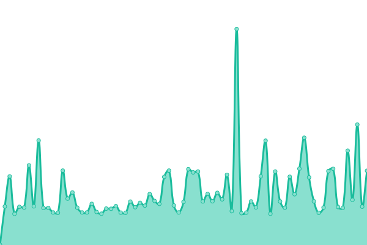
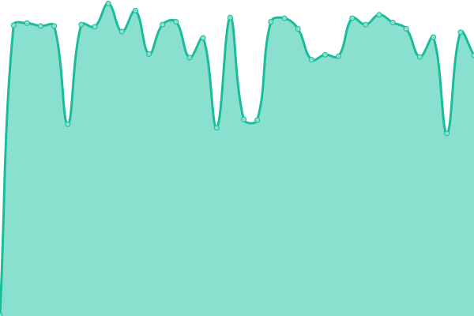
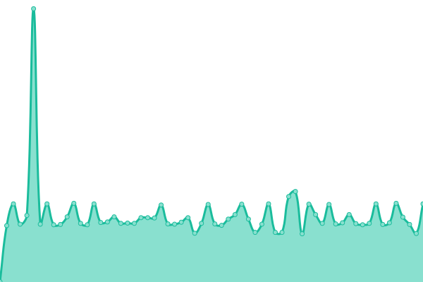

# [📈 Live Status](https://stats.masterstream.ir): <!--live status--> **🟧 Partial outage**

This repository contains the open-source uptime monitor and status page for [Amin.MasterkinG](https://masterking32.com), powered by [Upptime](https://github.com/upptime/upptime).

With [Upptime](https://upptime.js.org), you can get your own unlimited and free uptime monitor and status page, powered entirely by a GitHub repository. We use [Issues](https://github.com/masterking32/masterstream_uptime/issues) as incident reports, [Actions](https://github.com/masterking32/masterstream_uptime/actions) as uptime monitors, and [Pages](https://stats.masterstream.ir) for the status page.

<!--start: status pages-->
<!-- This summary is generated by Upptime (https://github.com/upptime/upptime) -->
<!-- Do not edit this manually, your changes will be overwritten -->
<!-- prettier-ignore -->
| URL | Status | History | Response Time | Uptime |
| --- | ------ | ------- | ------------- | ------ |
|  Website | 🟩 Up | [website.yml](https://github.com/masterking32/masterstream_uptime/commits/HEAD/history/website.yml) | 

 130ms
     
 | 

<a href="https://stats.masterstream.ir/history/website">100.00%</a>
    

|  Iran 1 - Afranet 1 | 🟩 Up | [iran-1-afranet-1.yml](https://github.com/masterking32/masterstream_uptime/commits/HEAD/history/iran-1-afranet-1.yml) | 

 361ms
     
 | 

<a href="https://stats.masterstream.ir/history/iran-1-afranet-1">100.00%</a>
    

|  Iran 2 - Afranet 2 | 🟩 Up | [iran-2-afranet-2.yml](https://github.com/masterking32/masterstream_uptime/commits/HEAD/history/iran-2-afranet-2.yml) | 

 367ms
     
 | 

<a href="https://stats.masterstream.ir/history/iran-2-afranet-2">100.00%</a>
    

|  Iran 3 - Afranet 3 | 🟩 Up | [iran-3-afranet-3.yml](https://github.com/masterking32/masterstream_uptime/commits/HEAD/history/iran-3-afranet-3.yml) | 

 365ms
     
 | 

<a href="https://stats.masterstream.ir/history/iran-3-afranet-3">100.00%</a>
    

|  Iran 4 - Afranet 4 | 🟥 Down | [iran-4-afranet-4.yml](https://github.com/masterking32/masterstream_uptime/commits/HEAD/history/iran-4-afranet-4.yml) | 

 0ms
     
 | 

<a href="https://stats.masterstream.ir/history/iran-4-afranet-4">0.00%</a>
    

|  Iran 5 - Zirsakht 1 | 🟩 Up | [iran-5-zirsakht-1.yml](https://github.com/masterking32/masterstream_uptime/commits/HEAD/history/iran-5-zirsakht-1.yml) | 

 242ms
     
 | 

<a href="https://stats.masterstream.ir/history/iran-5-zirsakht-1">100.00%</a>
    

|  Iran 6 - Zirsakht 2 (Tabriz) | 🟩 Up | [iran-6-zirsakht-2-tabriz.yml](https://github.com/masterking32/masterstream_uptime/commits/HEAD/history/iran-6-zirsakht-2-tabriz.yml) | 

 242ms
     
 | 

<a href="https://stats.masterstream.ir/history/iran-6-zirsakht-2-tabriz">100.00%</a>
    

|  Iran 7 - ParsOnline 1 | 🟩 Up | [iran-7-pars-online-1.yml](https://github.com/masterking32/masterstream_uptime/commits/HEAD/history/iran-7-pars-online-1.yml) | 

 340ms
     
 | 

<a href="https://stats.masterstream.ir/history/iran-7-pars-online-1">100.00%</a>
    

|  Iran 8 - ParsOnline 2 | 🟩 Up | [iran-8-pars-online-2.yml](https://github.com/masterking32/masterstream_uptime/commits/HEAD/history/iran-8-pars-online-2.yml) | 

 373ms
     
 | 

<a href="https://stats.masterstream.ir/history/iran-8-pars-online-2">100.00%</a>
    

|  Iran 9 - ParsOnline 3 | 🟩 Up | [iran-9-pars-online-3.yml](https://github.com/masterking32/masterstream_uptime/commits/HEAD/history/iran-9-pars-online-3.yml) | 

 240ms
     
 | 

<a href="https://stats.masterstream.ir/history/iran-9-pars-online-3">100.00%</a>
    

|  Iran 10 - Zirsakht 3 | 🟥 Down | [iran-10-zirsakht-3.yml](https://github.com/masterking32/masterstream_uptime/commits/HEAD/history/iran-10-zirsakht-3.yml) | 

 226ms
     
 | 

<a href="https://stats.masterstream.ir/history/iran-10-zirsakht-3">54.82%</a>
    

|  Iran 11 - ParsOnline 4 | 🟥 Down | [iran-11-pars-online-4.yml](https://github.com/masterking32/masterstream_uptime/commits/HEAD/history/iran-11-pars-online-4.yml) | 

 376ms
     
 | 

<a href="https://stats.masterstream.ir/history/iran-11-pars-online-4">50.42%</a>
    

|  Iran 12 - ParsOnline 5 | 🟩 Up | [iran-12-pars-online-5.yml](https://github.com/masterking32/masterstream_uptime/commits/HEAD/history/iran-12-pars-online-5.yml) | 

 222ms
     
 | 

<a href="https://stats.masterstream.ir/history/iran-12-pars-online-5">49.61%</a>
    

|  Turkey 1 | 🟩 Up | [turkey-1.yml](https://github.com/masterking32/masterstream_uptime/commits/HEAD/history/turkey-1.yml) | 

 159ms
     
 | 

<a href="https://stats.masterstream.ir/history/turkey-1">100.00%</a>
    

|  Russia 1 | 🟩 Up | [russia-1.yml](https://github.com/masterking32/masterstream_uptime/commits/HEAD/history/russia-1.yml) | 

 159ms
     
 | 

<a href="https://stats.masterstream.ir/history/russia-1">100.00%</a>
    

|  Out - Germany 1 | 🟩 Up | [out-germany-1.yml](https://github.com/masterking32/masterstream_uptime/commits/HEAD/history/out-germany-1.yml) | 

 130ms
     
 | 

<a href="https://stats.masterstream.ir/history/out-germany-1">100.00%</a>
    

|  Out - Germany 2 | 🟩 Up | [out-germany-2.yml](https://github.com/masterking32/masterstream_uptime/commits/HEAD/history/out-germany-2.yml) | 

 263ms
     
 | 

<a href="https://stats.masterstream.ir/history/out-germany-2">100.00%</a>
    

|  Out - Germany 3 | 🟩 Up | [out-germany-3.yml](https://github.com/masterking32/masterstream_uptime/commits/HEAD/history/out-germany-3.yml) | 

 129ms
     
 | 

<a href="https://stats.masterstream.ir/history/out-germany-3">100.00%</a>
    

|  Out - Germany 4 | 🟩 Up | [out-germany-4.yml](https://github.com/masterking32/masterstream_uptime/commits/HEAD/history/out-germany-4.yml) | 

 129ms
     
 | 

<a href="https://stats.masterstream.ir/history/out-germany-4">100.00%</a>
    

|  Out - Germany 5 | 🟩 Up | [out-germany-5.yml](https://github.com/masterking32/masterstream_uptime/commits/HEAD/history/out-germany-5.yml) | 

 129ms
     
 | 

<a href="https://stats.masterstream.ir/history/out-germany-5">100.00%</a>
    

|  Out - Germany 6 | 🟩 Up | [out-germany-6.yml](https://github.com/masterking32/masterstream_uptime/commits/HEAD/history/out-germany-6.yml) | 

 130ms
     
 | 

<a href="https://stats.masterstream.ir/history/out-germany-6">100.00%</a>
    

|  Out - France 1 | 🟩 Up | [out-france-1.yml](https://github.com/masterking32/masterstream_uptime/commits/HEAD/history/out-france-1.yml) | 

 134ms
     
 | 

<a href="https://stats.masterstream.ir/history/out-france-1">100.00%</a>
    

<!--end: status pages-->

[**Visit our status website →**](https://stats.masterstream.ir)

## 📄 License

- Powered by: [Upptime](https://github.com/upptime/upptime)
- Code: [MIT](./LICENSE) © [Amin.MasterkinG](https://masterking32.com)
- Data in the `./history` directory: [Open Database License](https://opendatacommons.org/licenses/odbl/1-0/)
