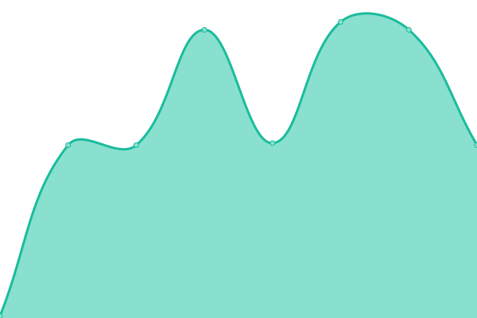
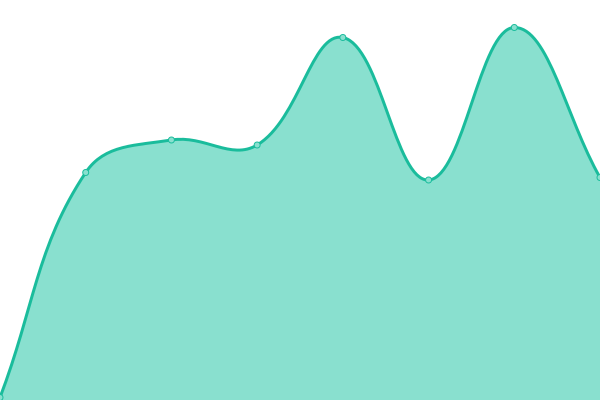

# [📈 Live Status](https://stats.masterstream.ir): <!--live status--> **🟧 Partial outage**

This repository contains the open-source uptime monitor and status page for [Amin.MasterkinG](https://masterking32.com), powered by [Upptime](https://github.com/upptime/upptime).

With [Upptime](https://upptime.js.org), you can get your own unlimited and free uptime monitor and status page, powered entirely by a GitHub repository. We use [Issues](https://github.com/masterking32/masterstream_uptime/issues) as incident reports, [Actions](https://github.com/masterking32/masterstream_uptime/actions) as uptime monitors, and [Pages](https://stats.masterstream.ir) for the status page.

<!--start: status pages-->
<!-- This summary is generated by Upptime (https://github.com/upptime/upptime) -->
<!-- Do not edit this manually, your changes will be overwritten -->
<!-- prettier-ignore -->
| URL | Status | History | Response Time | Uptime |
| --- | ------ | ------- | ------------- | ------ |
|  Website | 🟩 Up | [website.yml](https://github.com/masterking32/masterstream_uptime/commits/HEAD/history/website.yml) | 

 109ms
     
 | 

<a href="https://stats.masterstream.ir/history/website">100.00%</a>
    

|  Iran 1 - Ava | 🟥 Down | [iran-1-ava.yml](https://github.com/masterking32/masterstream_uptime/commits/HEAD/history/iran-1-ava.yml) | 

 0ms
     
 | 

<a href="https://stats.masterstream.ir/history/iran-1-ava">0.00%</a>
    

|  Iran 2 - Pishgaman | 🟩 Up | [iran-2-pishgaman.yml](https://github.com/masterking32/masterstream_uptime/commits/HEAD/history/iran-2-pishgaman.yml) | 

 185ms
     
 | 

<a href="https://stats.masterstream.ir/history/iran-2-pishgaman">28.40%</a>
    

|  Iran 3 - Mobin IDC | 🟩 Up | [iran-3-mobin-idc.yml](https://github.com/masterking32/masterstream_uptime/commits/HEAD/history/iran-3-mobin-idc.yml) | 

 187ms
     
 | 

<a href="https://stats.masterstream.ir/history/iran-3-mobin-idc">100.00%</a>
    

|  Iran 4 - ITC (Shiraz) | 🟩 Up | [iran-4-itc-shiraz.yml](https://github.com/masterking32/masterstream_uptime/commits/HEAD/history/iran-4-itc-shiraz.yml) | 

 231ms
     
 | 

<a href="https://stats.masterstream.ir/history/iran-4-itc-shiraz">98.03%</a>
    

|  Iran 5 - Systec | 🟩 Up | [iran-5-systec.yml](https://github.com/masterking32/masterstream_uptime/commits/HEAD/history/iran-5-systec.yml) | 

 184ms
     
 | 

<a href="https://stats.masterstream.ir/history/iran-5-systec">99.09%</a>
    

|  Germany 1 | 🟩 Up | [germany-1.yml](https://github.com/masterking32/masterstream_uptime/commits/HEAD/history/germany-1.yml) | 

 109ms
     
 | 

<a href="https://stats.masterstream.ir/history/germany-1">100.00%</a>
    

|  Germany 2 | 🟩 Up | [germany-2.yml](https://github.com/masterking32/masterstream_uptime/commits/HEAD/history/germany-2.yml) | 

 108ms
     
 | 

<a href="https://stats.masterstream.ir/history/germany-2">100.00%</a>
    

|  Germany 3 | 🟩 Up | [germany-3.yml](https://github.com/masterking32/masterstream_uptime/commits/HEAD/history/germany-3.yml) | 

 107ms
     
 | 

<a href="https://stats.masterstream.ir/history/germany-3">100.00%</a>
    

|  Out - Germany 1 | 🟩 Up | [out-germany-1.yml](https://github.com/masterking32/masterstream_uptime/commits/HEAD/history/out-germany-1.yml) | 

 108ms
     
 | 

<a href="https://stats.masterstream.ir/history/out-germany-1">100.00%</a>
    

|  Out - France 1 | 🟩 Up | [out-france-1.yml](https://github.com/masterking32/masterstream_uptime/commits/HEAD/history/out-france-1.yml) | 

 102ms
     
 | 

<a href="https://stats.masterstream.ir/history/out-france-1">100.00%</a>
    

|  Chat Support | 🟩 Up | [chat-support.yml](https://github.com/masterking32/masterstream_uptime/commits/HEAD/history/chat-support.yml) | 

 101ms
     
 | 

<a href="https://stats.masterstream.ir/history/chat-support">100.00%</a>
    

<!--end: status pages-->

[**Visit our status website →**](https://stats.masterstream.ir)

## 📄 License

- Powered by: [Upptime](https://github.com/upptime/upptime)
- Code: [MIT](./LICENSE) © [Amin.MasterkinG](https://masterking32.com)
- Data in the `./history` directory: [Open Database License](https://opendatacommons.org/licenses/odbl/1-0/)
